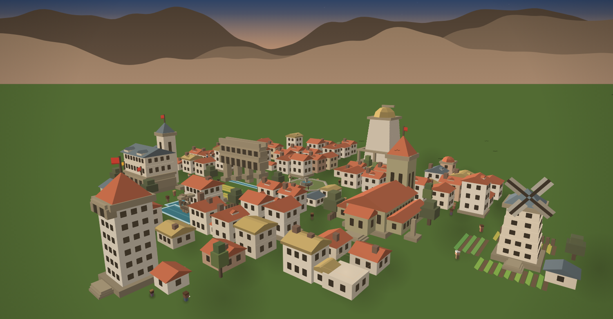

# Towny

Towny es una app de hábitos donde cada vez que cumplís ponés **una pieza**, y las
piezas van levantando un pueblo. No hay un número que sube ni una barra que se
llena: hay un sitio, en tres dimensiones, que crece con vos y que podés mirar
desde donde quieras. Si dejás de venir no se pierde nada de lo construido — sólo
se le van apagando las luces, y una sola pieza las vuelve a encender todas.

No está hecha para que seas perfecto, sino para que **abandonar del todo sea cada
vez más difícil**, que es una cosa distinta y bastante más alcanzable. Por eso no
hay rachas: un contador que se rompe hace que un mal día borre cuarenta buenos, y
tu comportamiento no hizo eso. Lo que mide en su lugar es cuánto tardás en
volver, que es la única cifra de toda la app que mejora cuando fallás. El resto
—lo que se construye, quién vive ahí, lo que el pueblo va aprendiendo de vos— se
descubre usándola.

---

Las APK de prueba están en [*Releases*](../../releases). Android 7.0 o superior.

*Por dentro: [por qué es así](DESIGN.md) · [cómo está hecho](ARCHITECTURE.md) ·
[lo que queda por hacer](PENDIENTES.md).*
